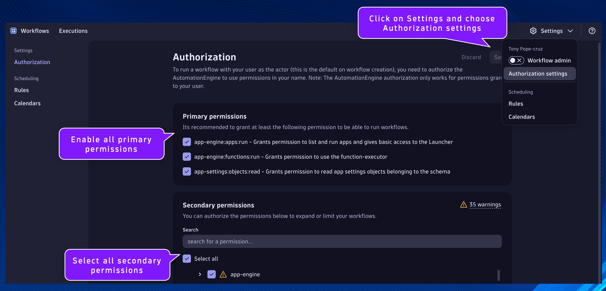

## Workflow Settings - Authorization

To run a workflow with your user as the actor (this is the default on workflow creation), you need to authorize the AutomationEngine to use permissions in your name. Note: The AutomationEngine authorization only works for permissions granted to your user.

In your Dynatrace environment, open the Workflows App.

Validate that the following permissions are granted to workflow executions.

Primary permissions:

[ x ] app-engine:apps:run - Grants permission to list and run apps and gives basic access to the Launcher

[ x ] app-engine:functions:run - Grants permission to use the function-executor

[ x ] app-settings:objects:read - Grants permission to read app settings objects belonging to the schema

Secondary permissions:

[ x ] select all