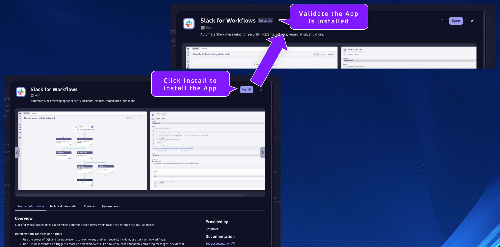

## Slack for Workflows

In your Dynatrace environment, search, locate, and open the Hub App.

Search for the App `Slack for Workflows` and click on it.

Click on Install to install the App into your environment.

Close any notification prompts if necessary.

Validate that the App was installed into your environment.

