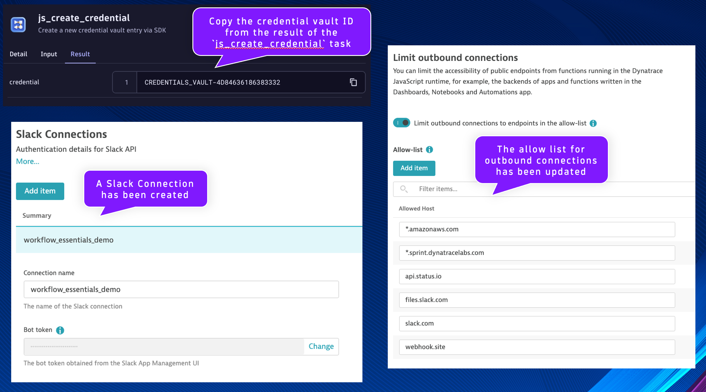

## Config Generator

In your Dynatrace environment, open the Workflows App.

Import the workflow 'Workflow Essentials - Config Generator' using the source file [`dt_wftpl_workflow_essentials_config_generator.yaml`](https://github.com/popecruzdt/dt-workflow-essentials/blob/main/assets/dt_wftpl_workflow_essentials_config_generator.yaml)

Workflows are imported using the Upload button.

Locate the `js_set_parameters` task.  Locate the code snippet for the Slack connection.

Set the `CONNECTION_TOKEN` value to the Slack App Bot User Token you have been provided (or have created).

Run the workflow and validate that it runs successfully.

As a result of the workflow, three configurations have been made to the Dynatrace environment:

1. A credential vault entry has been added containing a Dynatrace API token
    * Copy the credential vault ID from the result of the `js_create_credential` task and store it in your notes somewhere, it is needed in a future exercise
2. The allow list for outbound connections has been updated with the hosts/domains required for this lab
    * No action required, simply verify using screenshot below
3. A Slack Connection has been created called `workflow_essentials_demo`
    * No action required, simply verify using screenshot below

