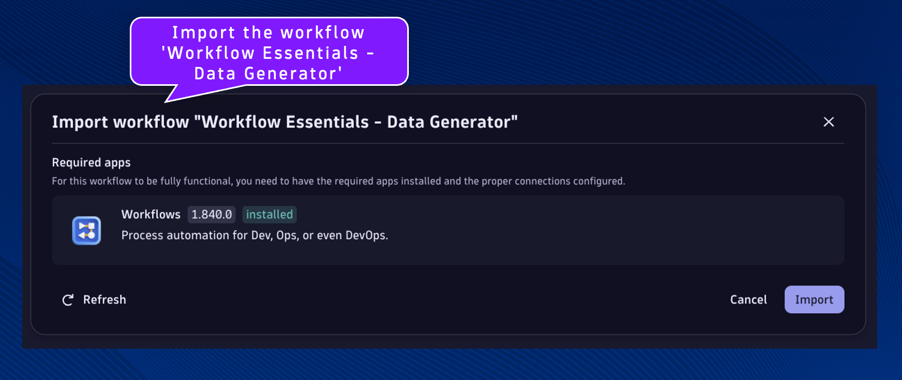
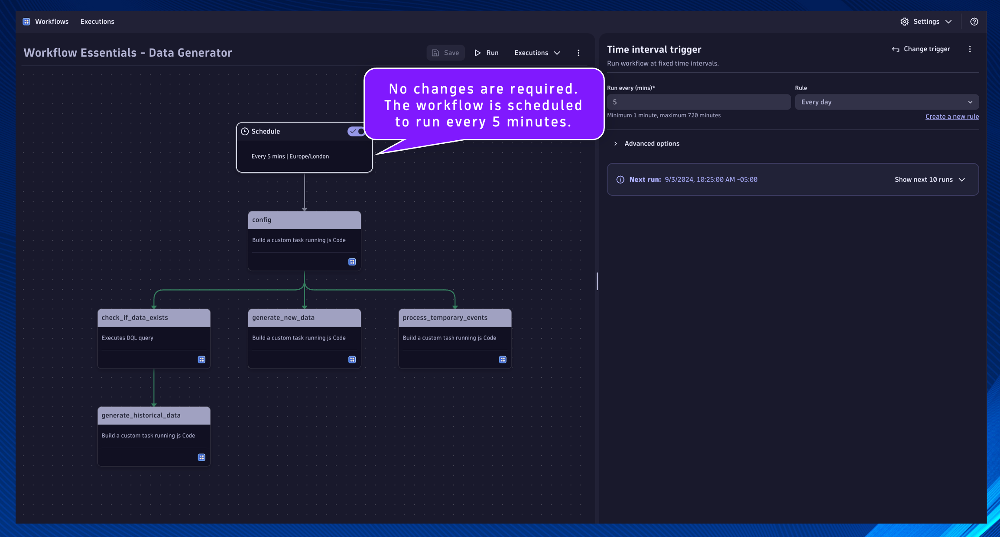

## Data Generator

In your Dynatrace environment, open the Workflows App.

Import the workflow 'Workflow Essentials - Data Generator' using the source file [`dt_wftpl_workflow_essentials_data_generator.yaml`](https://github.com/popecruzdt/dt-workflow-essentials/blob/main/assets/dt_wftpl_workflow_essentials_data_generator.yaml)

Workflows are imported using the Upload button.

No changes are required.  The workflow is scheduled to run every 5 minutes.

This workflow will generate bizevents representing a multi-stage business process.  This data will be used by the other workflows in the lab, removing the requirement to deploy OneAgents or ingest data through other mechanisms.