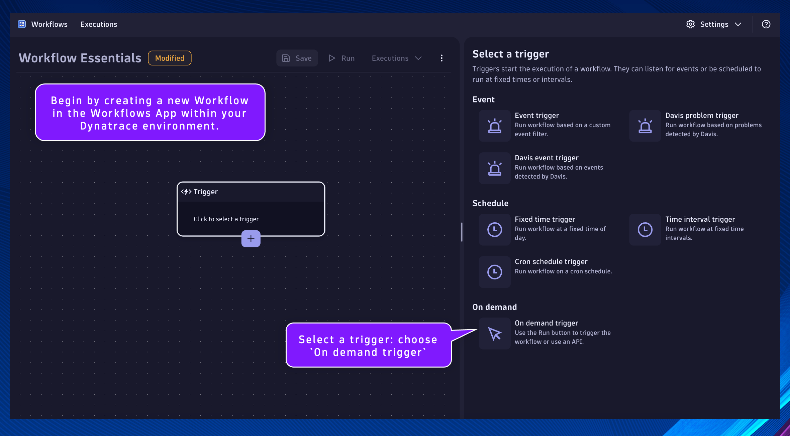
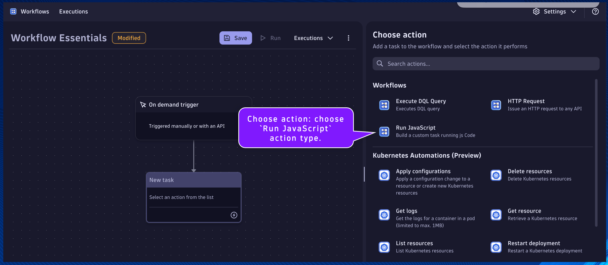
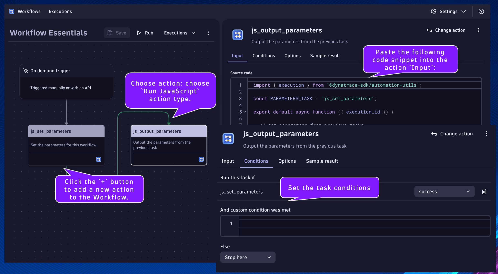

## Parameters and Task Results

Begin by creating a new Workflow in the Workflows App within your Dynatrace environment.

*Remember to save progress often!*

Select a trigger: choose `On demand trigger`



Click the `+` button to add a new action to the Workflow.


Choose action: choose `Run JavaScript` action type.




#### `js_set_parameters`

Name:
```text
js_set_parameters
```
Description:
```text
Set the parameters for this workflow
```

This will be the task/action that defines the parameters/variables that will be used by subsequent tasks and returns them in the result.  By setting the parameters as nested attribute key:value pairs within a single variable, as additional parameters are needed they can easily be added without modifying any other code.

Set the task name and description respectively.

Paste the following code snippet into the action `Input`:

```
export default async function () {

  let PARAMETERS = {

    // INITIALS - the initials of the user for this lab
    INITIALS: "", // i.e. INITIALS: "TPC"; the intials of the user for this lab are TPC
  
    // LOCATION - the city and country of the user for this lab
    LOCATION: "", // i.e. LOCATION: "Dallas, United States";
  
    // TENURE - the number of years of tenure of the user for this lab
    TENURE: ##, // i.e. TENURE: 14; the user for this lab has 14 years of tenure

    // STATUS_URL - the URL of the dynatrace status.io API
    STATUS_URL: "https://api.status.io/1.0/status/546d8cb6af8407b6730000cb", // i.e. STATUS_URL: "https://api.status.io/1.0/status/546d8cb6af8407b6730000cb"

    // WEBHOOK_URL- the URL of the webhook.site unique endpoint
    WEBHOOK_URL: "", // i.e. WEBHOOK_URL: "https://webhook.site/18637ec8-fcf9-43ec-86bf-993626982c6c"
  
  }
  
  return PARAMETERS;
}
```

Set the value of the missing variables:
- INITIALS: your initials
- LOCATION: your location
- TENURE: the number of years you've been with the company
- WEBHOOK_URL:
    * Navigate in your incognito browser window to https://webhook.site/ and copy your unique URL
      * The unique URL is located at the top of the page, not in your browser's address bar


#### `js_output_parameters`

Name:
```text
js_output_parameters
```
Description:
```text
Output the parameters from the previous task
```

This will be the task/action that accesses the parameters from the previous tasks results.  This will demonstrate how to do this within JS code.

Click the `+` button to add a new action to the Workflow.

Choose action: choose `Run JavaScript` action type.

Set the task name and description respectively.

Paste the following code snippet into the action `Input`:
```
import { execution } from '@dynatrace-sdk/automation-utils';

const PARAMETERS_TASK = 'js_set_parameters';

export default async function ({ execution_id }) {
  
  // get parameters from previous tasks
  // execution
  const ex = await execution(execution_id);
  // parameters
  const parameters = await ex.result(PARAMETERS_TASK);

  // log the parameters
  console.log(parameters);

  // declare new variables to easily access the parameters within this task
  const INITIALS = parameters['INITIALS'];
  const LOCATION = parameters['LOCATION'];
  const TENURE = parameters['TENURE'];

  // return a string that contains the parameters
  return "The lab user " + INITIALS + ", is located in " + LOCATION + ".  They have " + TENURE + " years of tenure.";
  
}
```

Click on the task's `Conditions` tab.  Set the `Run this task if`: `js_set_parameters` is `success`



Run the workflow and validate the results

