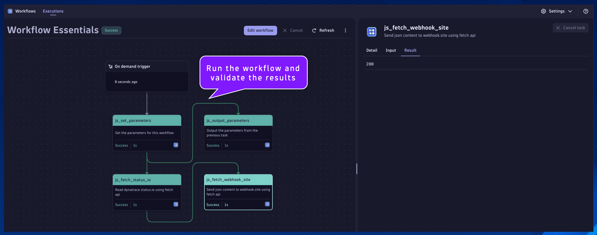

## Fetch API

#### `js_fetch_status_io`

Name:
```text
js_fetch_status_io
```
Description:
```text
Read dynatrace status.io using fetch api
```

This will be the task/action that uses the `fetch()` api to make an HTTP call to the Dynatrace status.io api.  This will demonstrate how to make HTTP calls using JS code, in order to bring in external data.

Locate the `js_set_parameters` task.

Click the `+` button to add a new action to the Workflow.

Choose action: choose `Run JavaScript` action type.

Set the task name and description respectively.

Paste the following code snippet into the action `Input`:
```
import { execution } from '@dynatrace-sdk/automation-utils';

const PARAMETERS_TASK = 'js_set_parameters';

export default async function ({ execution_id }) {

  // get parameters from previous tasks
  // execution
  const ex = await execution(execution_id);
  // parameters
  const parameters = await ex.result(PARAMETERS_TASK);
  // STATUS_URL
  const STATUS_URL = parameters['STATUS_URL'];
  
  // set the fetch() api parameters [method, headers, body]
  // https://developer.mozilla.org/en-US/docs/Web/API/Fetch_API/Using_Fetch
  const options = {
    method: "GET",
    headers: {
      'accept': "application/json",
    }
  };
  
  // execute the fetch() api call
  // set the url parameter equal to the status.io url parameter
  const url = STATUS_URL;
  // make the fetch call, passing the url and options, capture the response
  const response = await fetch(url,options);
  // parse the json response as a new variable
  const response_json = await response.json();
  // return the json response
  return response_json;
}
```

Click on the task's `Conditions` tab.  Set the `Run this task if`: `js_set_parameters` is `success`

Additionally, we only want this task to run if the `STATUS_URL` parameter is defined in the previous task.  We can access the result using a Jinja expression:
```js
1. {{ result("task_name") }}
2. {{ result("task_name")['result_attribute_name'] }}
3. {{ result("task_name")['result_attribute_name'] condition expression }}
```

[Expression Reference Documentation](https://docs.dynatrace.com/docs/platform-modules/automations/workflows/reference)

Set the `And custom condition was met`:
```js
{{ result("js_set_parameters")['STATUS_URL'] is defined }}
```


---
#### `js_fetch_webhook_site`

Name:
```text
js_fetch_webhook_site
```
Description:
```text
Send json content to webhook.site using fetch api
```

This will be the task/action that uses the `fetch()` api to make an HTTP call to webhook.site, a free webhook testing tool.  This will demonstrate how to make HTTP calls using JS code, in order to send data from workflows to external systems.

Locate the `js_fetch_status_io` task.

Click the `+` button to add a new action to the Workflow.

Choose action: choose `Run JavaScript` action type.

Set the task name and description respectively.

Paste the following code snippet into the action `Input`:
```
import { execution } from '@dynatrace-sdk/automation-utils';

const PARAMETERS_TASK = 'js_set_parameters';
const FETCH_STATUS_TASK = 'js_fetch_status_io';

export default async function ({ execution_id }) {

  // get parameters from previous tasks
  // execution
  const ex = await execution(execution_id);
  // parameters
  const parameters = await ex.result(PARAMETERS_TASK);
  // WEBHOOK_URL
  const WEBHOOK_URL = parameters['WEBHOOK_URL'];

  // get results from previous task
  // fetch status task result
  const status_result = await ex.result(FETCH_STATUS_TASK);
  
  // set the fetch() api parameters [method, headers, body]
  // https://developer.mozilla.org/en-US/docs/Web/API/Fetch_API/Using_Fetch
  const options = {
    method: "POST",
    headers: {
      'content-type': "application/json",
    },
    body: JSON.stringify(status_result)
  };
  
  // execute the fetch() api call
  // set the url parameter equal to the status.io url parameter
  const url = WEBHOOK_URL;
  // make the fetch call, passing the url and options, capture the response
  const response = await fetch(url,options);
  // capture the response code
  const response_status = response.status

  return response_status;
}
```

Click on the task's `Conditions` tab.  Set the `Run this task if`: `js_fetch_status_io` is `success`

Additionally, we only want this task to run if the `result` attribute is defined in the previous task.  We can access the result using a Jinja expression:

Set the `And custom condition was met`:
```
{{ result("js_fetch_status_io")['result'] is defined }}
```


Run the workflow and validate the results

