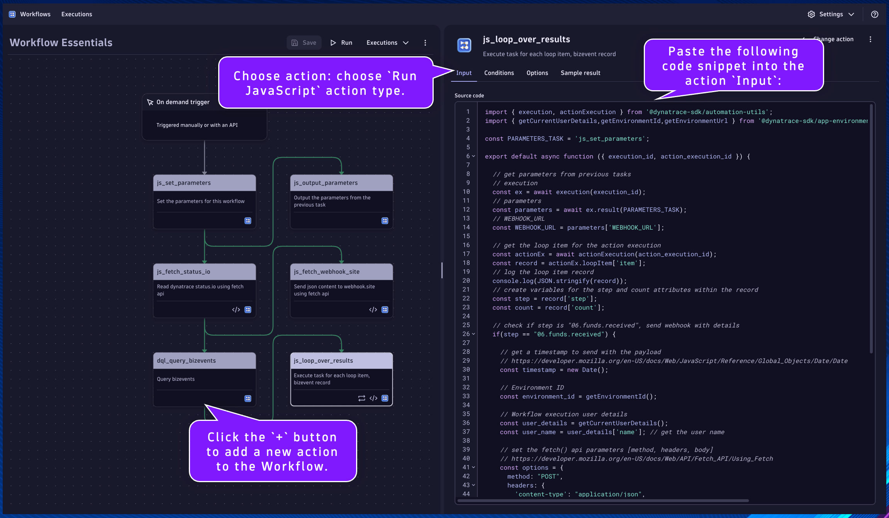

## Looping Tasks

#### `dql_query_bizevents`
Name:
```text
dql_query_bizevents
```
Description:
```text
Query bizevents
```

This will be the task/action that queries bizevents that are being generated from the data generator workflow.  This will demonstrate how to query data from Dynatrace (Grail) and use the data/results in subsequent tasks.

Locate the `js_fetch_status_io` task.

Click the `+` button to add a new action to the Workflow.

Choose action: choose `Execute DQL Query` action type.

Set the task name and description respectively.

Paste the following DQL query into the action `Input`:
```sql
fetch bizevents, from: now()-2h
| filter event.provider == "workflow.essentials.withdraw-processing"
| summarize count = count(), by: {step = event.type}
| sort step asc
```

Click on the task's `Conditions` tab.  Set the `Run this task if`: `js_fetch_status_io` is `success`


---
#### `js_loop_over_results`
Name:
```text
js_loop_over_results
```
Description:
```text
Execute task for each loop item, bizevent record
```

This will be the task/action that iterates over the results of a DQL query and performs desired activities.  If a result record matches a condition, it will use fetch() api to send data to webhook.site.

Locate the `dql_query_bizevents` task.

Click the `+` button to add a new action to the Workflow.

Choose action: choose `Run JavaScript` action type.

Set the task name and description respectively.

Paste the following code snippet into the action `Input`:
```
import { execution, actionExecution } from '@dynatrace-sdk/automation-utils';
import { getCurrentUserDetails,getEnvironmentId,getEnvironmentUrl } from '@dynatrace-sdk/app-environment';

const PARAMETERS_TASK = 'js_set_parameters';

export default async function ({ execution_id, action_execution_id }) {

  // get parameters from previous tasks
  // execution
  const ex = await execution(execution_id);
  // parameters
  const parameters = await ex.result(PARAMETERS_TASK);
  // WEBHOOK_URL
  const WEBHOOK_URL = parameters['WEBHOOK_URL'];
  
  // get the loop item for the action execution
  const actionEx = await actionExecution(action_execution_id);
  const record = actionEx.loopItem['item'];
  // log the loop item record
  console.log(JSON.stringify(record));
  // create variables for the step and count attributes within the record
  const step = record['step'];
  const count = record['count'];

  // check if step is "06.funds.received", send webhook with details
  if(step == "06.funds.received") {

    // get a timestamp to send with the payload
    // https://developer.mozilla.org/en-US/docs/Web/JavaScript/Reference/Global_Objects/Date/Date
    const timestamp = new Date();

    // Environment ID
    const environment_id = getEnvironmentId();

    // Workflow execution user details
    const user_details = getCurrentUserDetails();
    const user_name = user_details['name']; // get the user name
    
    // set the fetch() api parameters [method, headers, body]
    // https://developer.mozilla.org/en-US/docs/Web/API/Fetch_API/Using_Fetch
    const options = {
      method: "POST",
      headers: {
        'content-type': "application/json",
      },
      body: JSON.stringify({
        timestamp: timestamp.toISOString(), // https://developer.mozilla.org/en-US/docs/Web/JavaScript/Reference/Global_Objects/Date/toISOString
        step: step,
        count: count,
        environment: environment_id,
        user: user_name
      })
    };
    
    // execute the fetch() api call
    // set the url parameter equal to the status.io url parameter
    const url = WEBHOOK_URL;
    // make the fetch call, passing the url and options, capture the response
    const response = await fetch(url,options);
    // capture the response code
    const response_status = response.status
  
    return { step: step, count: count, response: response_status };
  }
  
  // return the step and count attributes
  return { step: step, count: count };
}
```



Click on the task's `Conditions` tab.  Set the `Run this task if`: `dql_query_bizevents` is `success`

Additionally, we only want this task to run if the result of the previous task has a `records` array with a `length > 0`.

Set the `And custom condition was met`:
```
{{ result("dql_query_bizevents").records | length > 0 }}
```
*note* `result("dql_query_bizevents").records` is the same as `result("dql_query_bizevents")['records']`

Finally, we want this task to execute as a loop.  This works by providing a `List` which is an array/list of data you want to iterate over and perform the task for each element/index.  You can provide data from a previous task using a Jinja expression.  You can access element/index through the provided `Item variable name`, either from JS code or Jinja expression.  Additionally, you can specify loop concurrency to increase parallel operations.

Click on the task's `Options` tab.  Toggle on `Loop task` setting.

Set the `Item variable name`:
```
item
```

Set the `List`:
```
{{ result("dql_query_bizevents").records }}
```


The loop item is access in our JS code with the following snippet:
```
// import the required package
import { actionExecution } from '@dynatrace-sdk/automation-utils';
// declare function
export default async function ({ execution_id, action_execution_id }) {
// get the loop item for the action execution
const actionEx = await actionExecution(action_execution_id);
const record = actionEx.loopItem['item'];
// we can now use the contents of record
console.log(record); // for example
// end function
}
```

Run the workflow and validate the results


