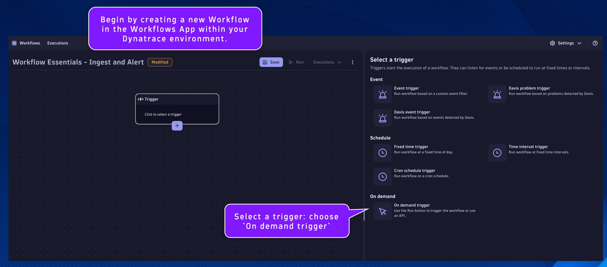
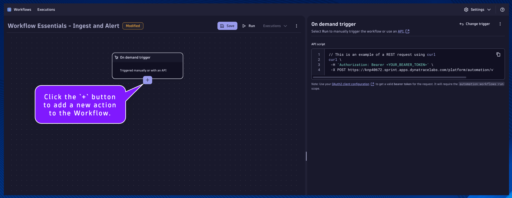
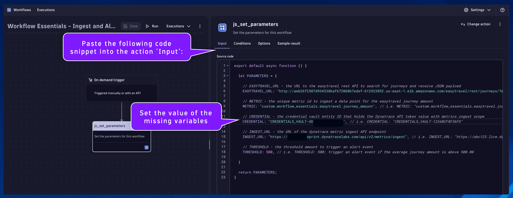

## Set Workflow Parameters

Begin by creating a new Workflow in the Workflows App within your Dynatrace environment.

*Remember to save progress often!*

Select a trigger: choose `On demand trigger`



Click the `+` button to add a new action to the Workflow.



Choose action: choose `Run JavaScript` action type.


---
#### `js_set_parameters`
Name:
```text
js_set_parameters
```
Description:
```text
Set the parameters for this workflow
```

This will be the task/action that defines the parameters/variables that will be used by subsequent tasks and returns them in the result.  By setting the parameters as nested attribute key:value pairs within a single variable, as additional parameters are needed they can easily be added without modifying any other code.

Set the task name and description respectively.

Paste the following code snippet into the action `Input`:
```
export default async function () {

  let PARAMETERS = {

    // EASYTRAVEL_URL - the URL to the easytravel rest API to search for journeys and receive JSON payload
    EASYTRAVEL_URL: "http://aeb26f2507d934338baf67206067edef-612923892.us-east-1.elb.amazonaws.com/easytravel/rest/journeys/?match=Dallas&from=&to=", // i.e. EASYTRAVEL_URL: "http://aeb26f2507d934338baf67206067edef-612923892.us-east-1.elb.amazonaws.com/easytravel/rest/journeys/?match=Dallas&from=&to="
  
    // METRIC - the unique metric id to ingest a data point for the easytravel journey amount
    METRIC: "custom.workflow_essentials.easytravel.journey_amount", // i.e. METRIC: "custom.workflow_essentials.easytravel.journey_amount"
  
    // CREDENTIAL - the credential vault entity ID that holds the Dynatrace API token value with metrics.ingest scope
    CREDENTIAL: "", // i.e. CREDENTIAL: "CREDENTIALS_VAULT-123ABCF8F36FD"

    // INGEST_URL - the URL of the dynatrace metric ingest API endpoint
    INGEST_URL: "https://<tenant-id>.live.dynatrace.com/api/v2/metrics/ingest", // i.e. INGEST_URL: "https://abc123.live.dynatrace.com/api/v2/metrics/ingest"

    // THRESHOLD - the threshold amount to trigger an alert event
    THRESHOLD: 500, // i.e. THRESHOLD: 500; trigger an alert event if the average journey amount is above 500.00
    
  }
  
  return PARAMETERS;
}
```

Set the value of the missing variables:
- CREDENTIAL:
    * Use the credential vault entry ID from the Workflow Essentials - Config Generator workflow execution
- INGEST_URL:
    * Replace `<tenant-id>` with your Dynatrace environment ID, i.e. `abc123`

