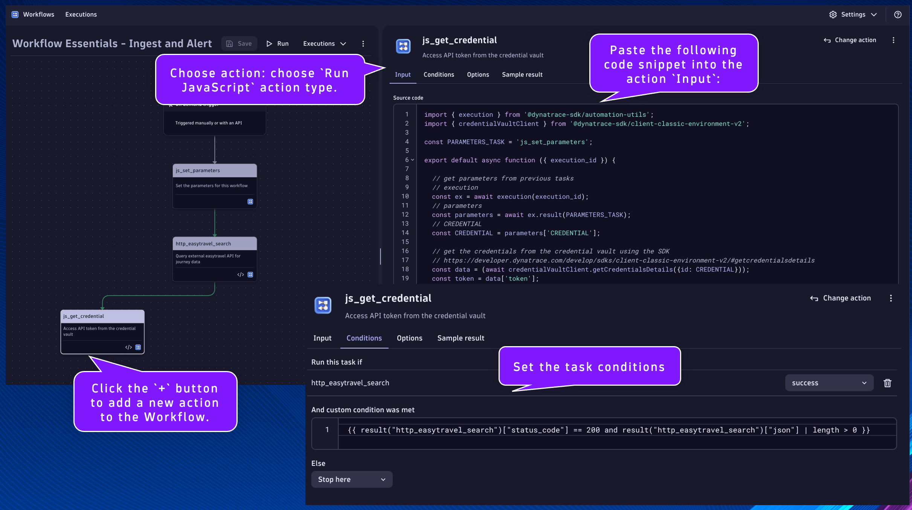

## Credential Vault with Dynatrace SDK

#### `js_get_credential`
Name:
```text
js_get_credential
```
Description:
```text
Access API token from the credential vault
```

This will be the task/action that uses the Dynatrace SDK to retrieve a credential from the vault.  Confidential data and parameters should be stored in the credential vault and not statically defined in the code.

Locate the `http_easytravel_search` task.

Click the `+` button to add a new action to the Workflow.

Choose action: choose `Run JavaScript` action type.

Set the task name and description respectively.

Paste the following code snippet into the action `Input`:
```
import { execution } from '@dynatrace-sdk/automation-utils';
import { credentialVaultClient } from '@dynatrace-sdk/client-classic-environment-v2';

const PARAMETERS_TASK = 'js_set_parameters';

export default async function ({ execution_id }) {

  // get parameters from previous tasks
  // execution
  const ex = await execution(execution_id);
  // parameters
  const parameters = await ex.result(PARAMETERS_TASK);
  // CREDENTIAL
  const CREDENTIAL = parameters['CREDENTIAL'];

  // get the credentials from the credential vault using the SDK
  // https://developer.dynatrace.com/develop/sdks/client-classic-environment-v2/#getcredentialsdetails
  const data = (await credentialVaultClient.getCredentialsDetails({id: CREDENTIAL}));
  const token = data['token'];
  
  return { token: token };
}
```

Click on the task's `Conditions` tab.  Set the `Run this task if`: `http_easytravel_search` is `success`

Additionally, we only want this task to run if the `status_code` is `200` and the response is not empty in the previous task.

Set the `And custom condition was met`:
```
{{ result("http_easytravel_search")["status_code"] == 200 and result("http_easytravel_search")["json"] | length > 0 }}
```

