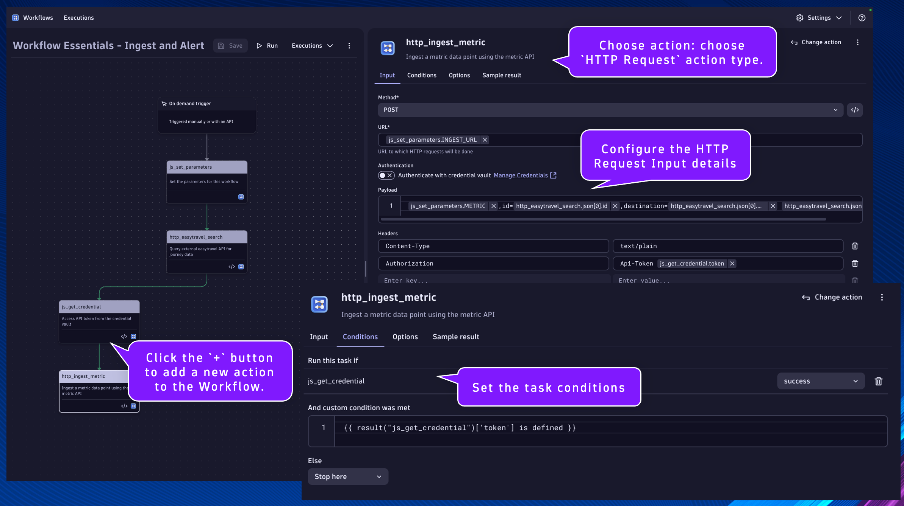
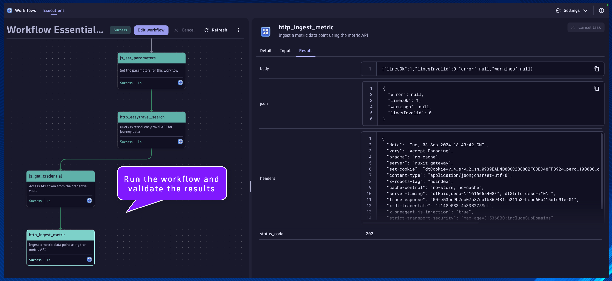

## Metric Ingest - Dynatrace API with Token

#### `http_ingest_metric`
Name:
```text
http_ingest_metric
```
Description:
```text
Ingest a metric data point using the metric API
```

This will be the task/action that ingests a metric data point from the previous task using an HTTP call to the metric ingest API with a token from the credential vault.

Locate the `js_get_credential` task.

Click the `+` button to add a new action to the Workflow.

Choose action: choose `HTTP Request` action type.

Set the task name and description respectively.

Configure the HTTP Request action `Input`:

Method:
```
POST
```

URL:
```
{{ result("js_set_parameters")['INGEST_URL'] }}
```

Payload:
```
{{ result("js_set_parameters")["METRIC"] }},id={{ result("http_easytravel_search")["json"][0]["id"] }},destination={{ result("http_easytravel_search")["json"][0]["destination"] }} {{ result("http_easytravel_search")["json"][0]["amount"] }}
```

Headers:
```
Content-Type  text/plain
Authorization   Api-Token {{ result("js_get_credential")["token"] }}
```

Error Handling:
```
Fail on certain HTTP response codes [Enabled]
```

HTTP error codes:
```
400-599
```

Click on the task's `Conditions` tab.  Set the `Run this task if`: `js_get_credential` is `success`

Additionally, we only want this task to run if the `token` parameter is defined in the previous task.

Set the `And custom condition was met`:
```
{{ result("js_get_credential")['token'] is defined }}
```



Run the workflow and validate the results

