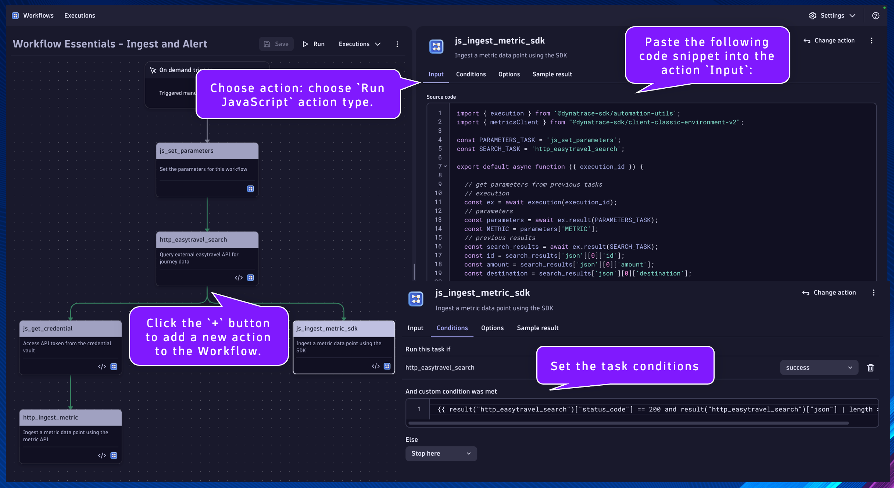
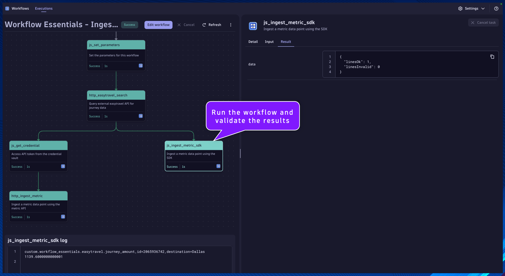

## Metric Ingest - Dynatrace SDK

#### `js_ingest_metric_sdk`
Name:
```text
js_ingest_metric_sdk
```
Description:
```text
Ingest a metric data point using the SDK
```

This will be the task/action that uses the Dynatrace SDK to ingest a metric data point.  The SDK makes it significantly easier to perform this function than using the API and authorization token.

Locate the `http_easytravel_search` task.

Click the `+` button to add a new action to the Workflow.

Choose action: choose `Run JavaScript` action type.

Set the task name and description respectively.

Paste the following code snippet into the action `Input`:
```
import { execution } from '@dynatrace-sdk/automation-utils';
import { metricsClient } from "@dynatrace-sdk/client-classic-environment-v2";

const PARAMETERS_TASK = 'js_set_parameters';
const SEARCH_TASK = 'http_easytravel_search';

export default async function ({ execution_id }) {

  // get parameters from previous tasks
  // execution
  const ex = await execution(execution_id);
  // parameters
  const parameters = await ex.result(PARAMETERS_TASK);
  const METRIC = parameters['METRIC'];
  // previous results
  const search_results = await ex.result(SEARCH_TASK);
  const id = search_results['json'][0]['id'];
  const amount = search_results['json'][0]['amount'];
  const destination = search_results['json'][0]['destination'];

  // build the line_protocol string to ingest the metric data point
  const line_protocol = METRIC + ',id=' + id + ',destination=' + destination + ' ' + amount;
  // (optional) log the line_protocol value
  console.log(line_protocol);
  // ingest the metric data point using the SDK
  // https://developer.dynatrace.com/develop/sdks/client-classic-environment-v2/#ingest-1
  const data = await metricsClient.ingest({
    body: line_protocol,
  });
  
  return { data: data };
}
```

Click on the task's `Conditions` tab.  Set the `Run this task if`: `http_easytravel_search` is `success`

Additionally, we only want this task to run if the `status_code` is `200` and the response is not empty in the previous task.

Set the `And custom condition was met`:
```
{{ result("http_easytravel_search")["status_code"] == 200 and result("http_easytravel_search")["json"] | length > 0 }}
```



Run the workflow and validate the results

