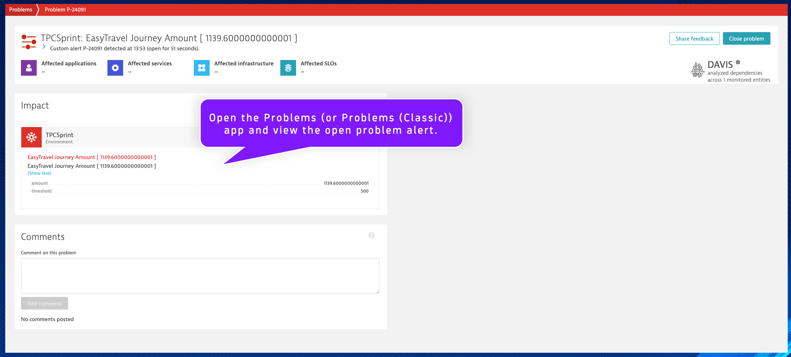

## Event Ingest - Dynatrace SDK

#### `js_wait_30_seconds`
Name:
```text
js_wait_30_seconds
```
Description:
```text
Wait 30 seconds for data to be processed
```

This will be the task/action that pauses workflow execution for 30 seconds with a timed wait using JS code.  This method can be useful when you need to pause task execution within your JS code task.  Additionally, you can configure any task to wait up to 60 seconds in the `Options` tab.

When data is ingested into the Dynatrace platform, it may not be available immediately.  To avoid a query from returning an empty result set, we'll wait 30 seconds for the data to be processed before continuing.

Locate the `http_ingest_metric` task.

Click the `+` button to add a new action to the Workflow.

Choose action: choose `Run JavaScript` action type.

Set the task name and description respectively.

Locate the `js_ingest_metric_sdk` task.

Click *and hold* the `+` button, then *drag* to connect this task to the `js_wait_30_seconds` task.

Paste the following code snippet into the action `Input`:
```
export default async function () {

  const sleep = async (waitTime: number) =>
  new Promise(resolve =>
    setTimeout(resolve, waitTime));
  
  const waitTime = async () => {
  // 30,000ms = 30 seconds to sleep
  await sleep(30000);
  console.log("Finished Waiting");
  }

  console.log("Waiting 30 Seconds");
  waitTime();
  
}
```

Click on the task's `Conditions` tab.  Set the `Run this task if`: `js_ingest_metric_sdk` is `success` and `http_ingest_metric` is `success`


---
#### `js_dql_query_alert`
Name:
```text
js_dql_query_alert
```
Description:
```text
Query metric data point and generate an alert via SDK
```

This will be the task/action that uses the Dynatrace SDK to execute a DQL query to retrieve a metric data point and trigger an alert event if the value crosses a threshold.  Using the Dynatrace SDK is an alternative method for running a DQL query within workflows.  When a Davis problem event is triggered using the Dynatrace SDK within workflows, the event is stored in Grail and the problem is available in the Problems app.

Locate the `js_wait_30_seconds` task.

Click the `+` button to add a new action to the Workflow.

Choose action: choose `Run JavaScript` action type.

Paste the following code snippet into the action `Input`:
```
import { execution } from '@dynatrace-sdk/automation-utils';
import { queryExecutionClient } from "@dynatrace-sdk/client-query";
import { eventsClient, EventIngestEventType } from "@dynatrace-sdk/client-classic-environment-v2";

const PARAMETERS_TASK = 'js_set_parameters';
const SEARCH_TASK = 'http_easytravel_search';

export default async function ({ execution_id }) {

  // get parameters from previous tasks
  // execution
  const ex = await execution(execution_id);
  // parameters
  const parameters = await ex.result(PARAMETERS_TASK);
  const METRIC = parameters['METRIC'];
  const THRESHOLD = parameters['THRESHOLD'];
  // previous results
  const search_results = await ex.result(SEARCH_TASK);
  const destination = search_results['json'][0]['destination'];
  
  // build the DQL query for the metric
  // query the metric value for the last 5 minutes
  // https://developer.dynatrace.com/develop/sdks/client-query/#queryexecute
  const timeout = 60;
  const query = 'timeseries journey_amount = avg(' + METRIC + '), by: {destination}, from: now()-5m\
                  | filter destination == "' + destination + '"\
                  | summarize avg_amount = avg(arrayAvg(journey_amount))';
  
  const query_response = await queryExecutionClient.queryExecute({ body: { query, requestTimeoutMilliseconds: timeout * 1000, fetchTimeoutSeconds: timeout  } });

  // check if the query result is empty (unexpectedly)
  if(query_response.result.records.length == 0) {
    console.log("Query returned an empty result unexpectedly!");
    return query_response.result;
  }

  // capture the average journey amount from query response
  const avg_amount = parseFloat(query_response.result.records[0]['avg_amount']);

  // check if the avg amount value is above the threshold parameter, if true then raise alert event
  if(avg_amount > THRESHOLD) {

    // https://developer.dynatrace.com/develop/sdks/client-classic-environment-v2/#createevent
    const event_response = await eventsClient.createEvent({
      // https://developer.dynatrace.com/develop/sdks/client-classic-environment-v2/#eventingest
      body : {
        eventType: EventIngestEventType.CustomAlert, // https://developer.dynatrace.com/develop/sdks/client-classic-environment-v2/#eventingesteventtype
        title: 'EasyTravel Journey Amount [ ' + avg_amount + ' ]',
        timeout: 5,
        properties: {
          'amount': avg_amount,
          'threshold' : THRESHOLD,
        }
      }
    });
    
    // validate that the alert event was created, return the correlationId and details
    if(event_response.eventIngestResults[0].status == "OK") {
      return {
        amount: avg_amount,
        threshold: THRESHOLD,
        correlationId: event_response.eventIngestResults[0].correlationId
      }
    } else {
      return {
        amount: avg_amount,
        threshold: THRESHOLD,
        correlationId: "ERROR"
      }
    }
  }
}
```

Click on the task's `Conditions` tab.  Set the `Run this task if`: `js_wait_30_seconds` is `success`


Run the workflow and validate the results


After validating that the workflow execution was successful and the `js_dql_query_alert` result has a populated `correlationId` value, open the Problems (or Problems (Classic)) app and view the open problem alert.

