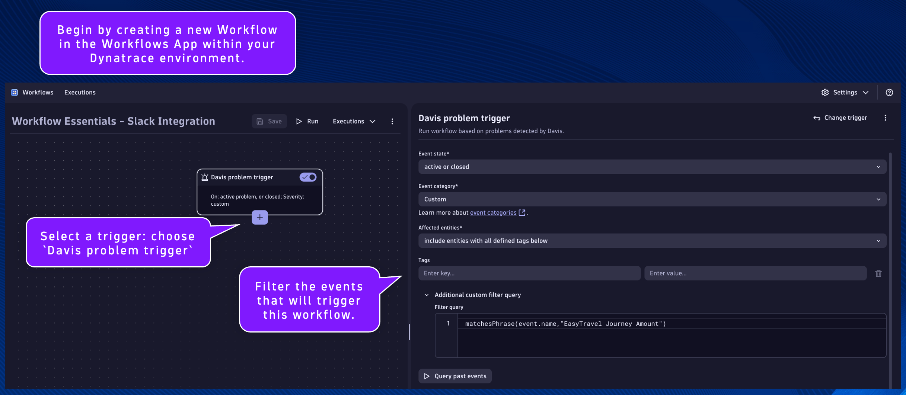

## Davis Problem Event Trigger

Begin by creating a new Workflow in the Workflows App within your Dynatrace environment.

*Remember to save progress often!*

Select a trigger: choose `Davis problem trigger`

Filter the events that will trigger this workflow.

Event state:
```
active or closed
```

Event category:
```
Custom
```

Affected entities:
```
include entities with all defined tagged below
```

Additional custom filter query:
```
matchesPhrase(event.name,"EasyTravel Journey Amount")
```

