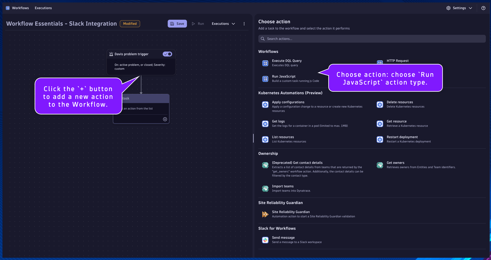
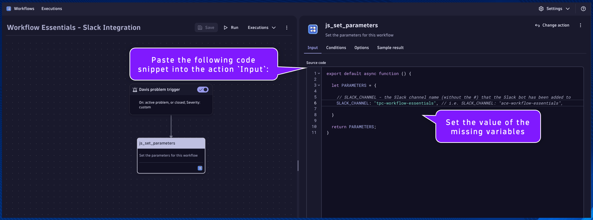

## Set Workflow Parameters

Click the `+` button to add a new action to the Workflow.

Choose action: choose `Run JavaScript` action type.



---
#### `js_set_parameters`
Name:
```text
js_set_parameters
```
Description:
```text
Set the parameters for this workflow
```

This will be the task/action that defines the parameters/variables that will be used by subsequent tasks and returns them in the result.  By setting the parameters as nested attribute key:value pairs within a single variable, as additional parameters are needed they can easily be added without modifying any other code.

Set the task name and description respectively.

Paste the following code snippet into the action `Input`:
```
export default async function () {

  let PARAMETERS = {

    // SLACK_CHANNEL - the Slack channel name (without the #) that the Slack bot has been added to
    SLACK_CHANNEL: "", // i.e. SLACK_CHANNEL: "workflow-essentials",
    
  }
  
  return PARAMETERS;
}
```

Set the value of the missing variables:
- SLACK_CHANNEL:
    * Use the channel name you have been provided (or have created)

