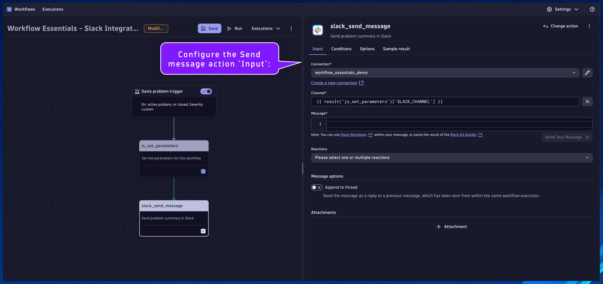

## Slack Integration

#### `slack_send_message`
Name:
```text
slack_send_message
```
Description:
```text
Send problem summary in Slack
```

This will be the task/action that uses the Slack connection to send a problem summary message to a Slack channel.

Locate the `js_set_parameters` task.

Click the `+` button to add a new action to the Workflow.

Choose action: choose `Send message` action type from the Slack for Workflows section/app.


Set the task name and description respectively.

Configure the Send message action `Input`:

Connection:
```
workflow_essentials_demo
```
*This connection was created by the Workflow Essentials - Config Generator workflow*

Channel:
```
{{ result("js_set_parameters")['SLACK_CHANNEL'] }}
```

Message:
```
{
	"blocks": [
		{
			"type": "section",
			"block_id": "sectionHeader",
			"text": {
				"type": "mrkdwn",
				"text": "Dynatrace :dt: Problem Detection \n Workflow Execution: [{{ execution().id }}]"
			}
		},
		{
			"type": "divider"
		},
		{
			"type": "section",
			"block_id": "problemState",
			"text": {
				"type": "mrkdwn",
				"text": "Problem State:  :warning: OPEN :warning:   :white_check_mark: RESOLVED :white_check_mark: "
			}
		},
		{
			"type": "divider"
		},
		{
			"type": "section",
			"block_id": "problemSummary",
			"text": {
				"type": "mrkdwn",
				"text": "Problem Number: [*{{ event()['display_id'] }}*] \n Problem ID: [ {{ event()['event.id'] }} ] \n [ {{ event()['event.name'] }} ]"
			}
		},
		{
			"type": "divider"
		},
		{
			"type": "actions",
			"elements": [
				{
					"type": "button",
					"text": {
						"type": "plain_text",
						"text": "View Problem",
						"emoji": true
					},
					"value": "problem",
					"url": "{{ environment().url }}/ui/apps/dynatrace.classic.problems/#problems/problemdetails;pid={{ event()['event.id'] }}"
				},
				{
					"type": "button",
					"text": {
						"type": "plain_text",
						"text": "View Workflow Execution",
						"emoji": true
					},
					"value": "workflow",
					"url": "{{ environment().url }}/ui/apps/dynatrace.automations/executions/{{ execution().id }}"
				}
			]
		}
	]
}
```



Click on the task's `Conditions` tab.  Set the `Run this task if`: `js_set_parameters` is `success`

Additionally, we only want this task to run if the `SLACK_CHANNEL` parameter is defined in the previous task.  We can access the result using a Jinja expression:
```
1. {{ result("task_name") }}
2. {{ result("task_name")['result_attribute_name'] }}
3. {{ result("task_name")['result_attribute_name'] condition expression }}
```

[Expression Reference Documentation](https://docs.dynatrace.com/docs/platform-modules/automations/workflows/reference)

Set the `And custom condition was met`:
```
{{ result("js_set_parameters")['SLACK_CHANNEL'] is defined }}
```

