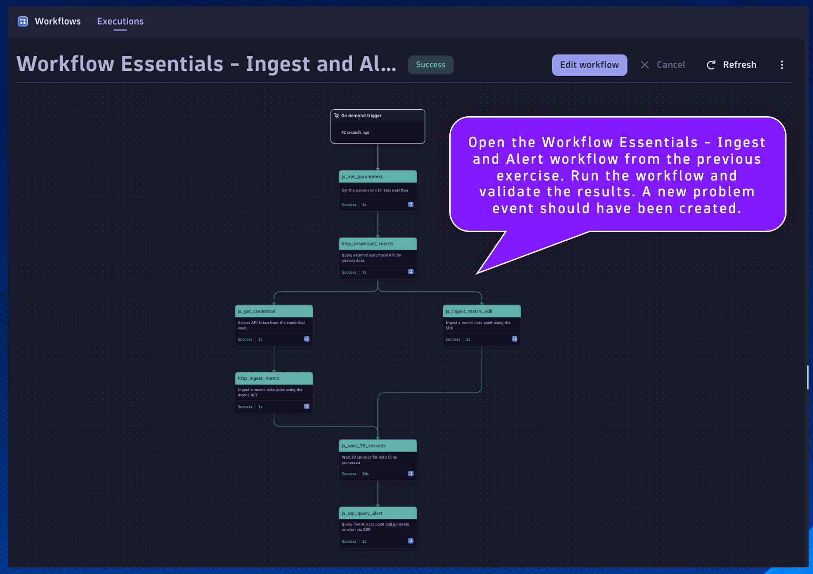

## Trigger Workflow Execution

Open the Workflow Essentials - Ingest and Alert workflow from the previous exercise.  Run the workflow and validate the results.  A new problem event should have been created.

Shortly after running the other workflow, the Workflow Essentials - Slack Integration workflow should have triggered as a result of the problem event.  Check the execution and validate the results.  Open the Slack channel and validate that the message contains the problem summary.

Third party integrations are available as Workflow Action Apps, which are available in the Hub.

