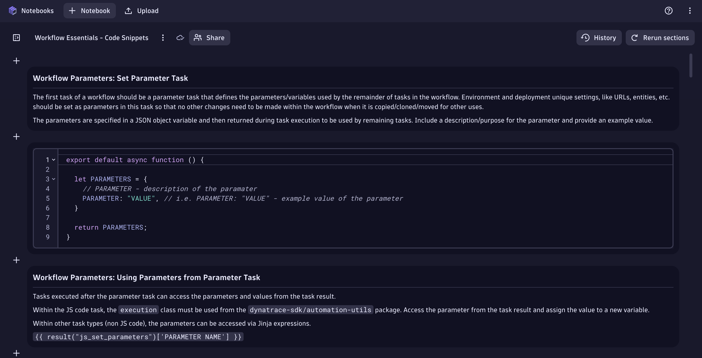

## Code Snippets

Code Snippets Notebook

[Workflow Essentials Code Snippets](https://github.com/popecruzdt/dt-workflow-essentials/blob/main/assets/Workflow_Essentials_-_Code_Snippets.json)



### Workflow Parameters: Set Parameter Task

The first task of a workflow should be a parameter task that defines the parameters/variables used by the remainder of tasks in the workflow.  Environment and deployment unique settings, like URLs, entities, etc. should be set as parameters in this task so that no other changes need to be made within the workflow when it is copied/cloned/moved for other uses.

The parameters are specified in a JSON object variable and then returned during task execution to be used by remaining tasks.  Include a description/purpose for the parameter and provide an example value.

```js
export default async function () {
  
  let PARAMETERS = {
    // PARAMETER - description of the parameter
    PARAMETER: "VALUE", // i.e. PARAMETER: "VALUE" - example value of the parameter
  }
  
  return PARAMETERS;
}
```

### Workflow Parameters: Using Parameters from Parameter Task

Tasks executed after the parameter task can access the parameters and values from the task result.

Within the JS code task, the `execution` class must be used from the `dynatrace-sdk/automation-utils` package.  Access the parameter from the task result and assign the value to a new variable.

Within other task types (non JS code), the parameters can be accessed via Jinja expressions.

`{{ result("js_set_parameters")['PARAMETER NAME'] }}`

```js
import { execution } from '@dynatrace-sdk/automation-utils';

const PARAMETERS_TASK = 'js_set_parameters';

export default async function ({ execution_id }) {
  
  // get parameters from previous tasks
  // execution
  const ex = await execution(execution_id);
  // parameters
  const parameters = await ex.result(PARAMETERS_TASK);

  // declare new variables to easily access the parameters within this task
  const PARAMETER = parameters['PARAMETER'];
  
}
```

### App Environment Utilities

There are app environment utilities available so that static coding of these values within the workflow are not necessary.

https://developer.dynatrace.com/develop/sdks/app-environment/

```js
import { getCurrentUserDetails } from '@dynatrace-sdk/app-environment';
import { getEnvironmentId } from '@dynatrace-sdk/app-environment';
import { getEnvironmentUrl } from '@dynatrace-sdk/app-environment';

// import all 3
import { getCurrentUserDetails,getEnvironmentId,getEnvironmentUrl } from '@dynatrace-sdk/app-environment';

export default async function () {

  // get current workflow execution user details
  const user_details = getCurrentUserDetails(); // returns id, name, email in JSON format
  const user_email = user_details['email']; // get the user email address
  const user_id = user_details['id']; // get the user id (UUID)
  const user_name = user_details['name']; // get the user name

  // get current workflow execution environment id (abc123)
  const environment_id = getEnvironmentId();

  // get current workflow execution environment URL (abc123.apps.dynatrace.com)
  const environment_url = getEnvironmentUrl();
  
}
```

### Working with Loop Actions

Workflow actions can be configured to run as loops with an array of input data as loop items.

In the action options, an array (typically a result from a previous task) is provided as input. A loop item variable name is also provided for accessing the array element during each loop execution.

Within the JS code task, the `actionExecution` class must be used from the `dynatrace-sdk/automation-utils` package.

Access the loop item from `actionExecution().loopItem['loop item variable name']`.

Within other task types (non JS code), the parameters can be accessed via Jinja expressions.

`{{ _.loop item variable name }}`

```js
import { execution, actionExecution } from '@dynatrace-sdk/automation-utils';

export default async function ({ execution_id, action_execution_id }) {

  // execution
  const ex = await execution(execution_id);
  
  // get the loop item for the action execution
  const actionEx = await actionExecution(action_execution_id);
  const loop_item = actionEx.loopItem['item']; // Loop item variable name from task options

}
```

### Timed Wait within Workflow and Action Execution

There may be a need to perform a timed wait within the execution of a workflow or within a JS code action.  TypeScript provides the capabilities to perform a sleep for a specified amount of time.  The action and the workflow execution will be paused during this time.

Additionally, workflow actions can be configured to 'Wait before' for a specified amount of time.  The entire workflow action will wait that amoutn of time before beginning execution.

```js
export default async function () {

  const sleep = async (waitTime: number) =>
  new Promise(resolve =>
    setTimeout(resolve, waitTime));
  
  const waitTime = async () => {
  // 30,000ms = 30 seconds to sleep
  await sleep(30000);
  console.log("Finished Waiting");
  }

  console.log("Waiting 30 Seconds");
  waitTime();
  
}
```

### Getting External Data via HTTP(S) with fetch()

Workflows can be used to retrieve external data from systems accessible via HTTP(S) and return JSON payloads.

The `fetch()` API can be used to execute HTTP(S) calls and retrieve JSON responses.

https://developer.mozilla.org/en-US/docs/Web/API/Fetch_API/Using_Fetch

In order to access external systems, you must configure the domain in the allow list for outbound connections.

https://developer.dynatrace.com/develop/app-functions/allow-outbound-connections/

For HTTPS calls, the URL/domain/host must have a valid signed SSL certificate or the call will fail.  There is no way to bypass the SSL certificate check due to data privacy and security standards.

```js
export default async function () {
  
  // set the fetch() api parameters [method, headers, body]
  // https://developer.mozilla.org/en-US/docs/Web/API/Fetch_API/Using_Fetch
  const options = {
    method: "GET",
    headers: {
      'accept': "application/json",
    }
  };

  // set the url for the fetch call
  const url = "http://hostname:port/uri"
  // make the fetch call, passing the url and options, capture the response
  const response = await fetch(url,options);
  // parse the json response as a new variable
  const response_json = await response.json();
  // return the json response
  return response_json;
  
}
```

### Sending Data to External Systems via HTTP(S) with fetch()

Workflows can be used to send data (preferably JSON payload) to external systems accessible via HTTP(S).

The `fetch()` API can be used to execute HTTP(S) calls and send (JSON) payloads.

https://developer.mozilla.org/en-US/docs/Web/API/Fetch_API/Using_Fetch

In order to access external systems, you must configure the domain in the allow list for outbound connections.

https://developer.dynatrace.com/develop/app-functions/allow-outbound-connections/

For HTTPS calls, the URL/domain/host must have a valid signed SSL certificate or the call will fail.  There is no way to bypass the SSL certificate check due to data privacy and security standards.

```js
export default async function () {
  
  // set the fetch() api parameters [method, headers, body]
  // https://developer.mozilla.org/en-US/docs/Web/API/Fetch_API/Using_Fetch
  const json_body = {
    key: "value"
  }

  const options = {
    method: "POST",
    headers: {
      'content-type': "application/json",
    },
    body: JSON.stringify(json_body) // convert json object to json string
  };
  
  // set the url for the fetch call
  const url = "http://hostname:port/uri"
  // make the fetch call, passing the url and options, capture the response
  const response = await fetch(url,options);
  // capture the response code
  const response_status = response.status

  return response_status;
  
}
```

### JavaScript Runtime: Dynatrace SDK for TypeScript

The SDK for TypeScript provides a TypeScript API for Dynatrace platform services and Dynatrace AppEngine functionality.

https://developer.dynatrace.com/develop/sdks/

It consists of the following:
* TypeScript packages focused on specific use cases to use Dynatrace platform functionality.
* Modular clients for each Dynatrace platform service to reduce overhead on a specific use.

### Executing DQL Queries within JS Code Actions

While there is a DQL workflow action type, it may be beneficial to execute a DQL query from within a JS code action.  This can be accomplished using the `queryExecutionClient` from the `dynatrace-sdk/client-query` package.

https://developer.dynatrace.com/develop/sdks/client-query/#queryexecute

```js
import { queryExecutionClient } from "@dynatrace-sdk/client-query";

export default async function () {
  
  // build the DQL query
  // https://developer.dynatrace.com/develop/sdks/client-query/#queryexecute
  const timeout = 60;
  const query = 'timeseries metric = avg(' + metric + '), by: {dimension}, from: now()-5m\
                  | filter dimension == "' + dimension + '"\
                  | summarize avg = avg(arrayAvg(metric))';
  
  const query_response = await queryExecutionClient.queryExecute({ body: { query, requestTimeoutMilliseconds: timeout * 1000, fetchTimeoutSeconds: timeout  } });

  // check if the query result is empty (unexpectedly)
  if(query_response.result.records.length == 0) {
    console.log("Query returned an empty result unexpectedly!");
    return query_response.result;
  }

  return query_response.result;
  
}
```

### Credential Vault Access via SDK

During workflow execution, integration with external systems may require credentials.  Those credentials should be accessed securely from the credential vault and not static coded into the workflow itself.

Credentials can be accessed using `credentialVaultClient` from the `dynatrace-sdk/client-classic-environment-v2` package.

When a credential is obtained, it contains the `token` value or the `username` and `password` values respectively.

https://developer.dynatrace.com/develop/sdks/client-classic-environment-v2/#getcredentialsdetails

```js
import { credentialVaultClient } from '@dynatrace-sdk/client-classic-environment-v2';

export default async function () {

  // CREDENTIAL - the credential vault entity ID
  const CREDENTIAL = "CREDENTIALS_VAULT-ABC1235EEF8F36FD";

  // get the credentials from the credential vault using the SDK
  // https://developer.dynatrace.com/develop/sdks/client-classic-environment-v2/#getcredentialsdetails
  const data = (await credentialVaultClient.getCredentialsDetails({id: CREDENTIAL}));
  const token = data['token'];
  const username = data['username'];
  const password = data['password'];
  
}
```

### Metric Ingest via SDK

Data ingest is a common use case for workflows.  Logs, traces, events, and metrics can all be ingested during workflow execution.

Metric ingestion is possible with the `metricsClient` from the `dynatrace-sdk/client-classic-environment-v2` package.

https://developer.dynatrace.com/develop/sdks/client-classic-environment-v2/#ingest-1

The metric ingest utilizes the metric line protocol format:

https://docs.dynatrace.com/docs/extend-dynatrace/extend-metrics/reference/metric-ingestion-protocol

```js
import { metricsClient } from "@dynatrace-sdk/client-classic-environment-v2";

export default async function () {

  // build the line_protocol string to ingest the metric data point
  const line_protocol = 'metric' + ',dimension-name=dimension-value' + ' value'; // mymetric,team=teamA,businessapp=hr 1000
  
  // ingest the metric data point using the SDK
  // https://developer.dynatrace.com/develop/sdks/client-classic-environment-v2/#ingest-1
  const data = await metricsClient.ingest({
    body: line_protocol,
  });
  
}
```

### Event Ingestion (and Alerting) via SDK

Generating alerts (events, problem events) is a common use case for workflows.

Events can be ingested/created using the `eventsClient` from the `dynatrace-sdk/client-classic-environment-v2` package.

https://developer.dynatrace.com/develop/sdks/client-classic-environment-v2/#createevent

There multiple event types that can be created via the `EventIngestEventType` class:

https://developer.dynatrace.com/develop/sdks/client-classic-environment-v2/#eventingesteventtype

```js
import { eventsClient, EventIngestEventType } from "@dynatrace-sdk/client-classic-environment-v2";

export default async function () {

  // https://developer.dynatrace.com/develop/sdks/client-classic-environment-v2/#createevent
  const event_response = await eventsClient.createEvent({
    // https://developer.dynatrace.com/develop/sdks/client-classic-environment-v2/#eventingest
    body : {
      eventType: EventIngestEventType.CustomAlert, // https://developer.dynatrace.com/develop/sdks/client-classic-environment-v2/#eventingesteventtype
      title: 'Event Title',
      timeout: 5,
      properties: {
        'property-1': value,
        'property-2': 'value',
      }
    }
  });

}
```